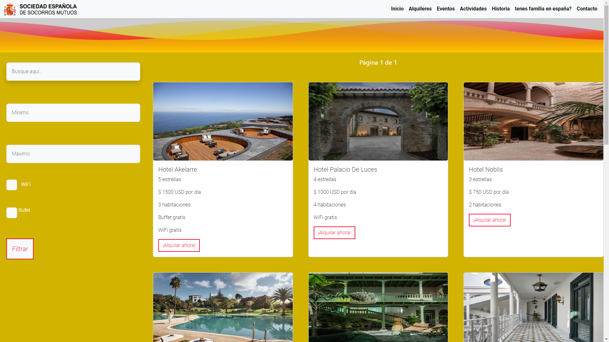
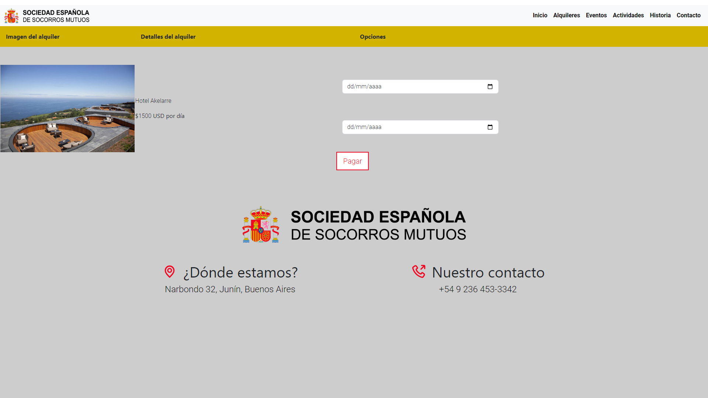
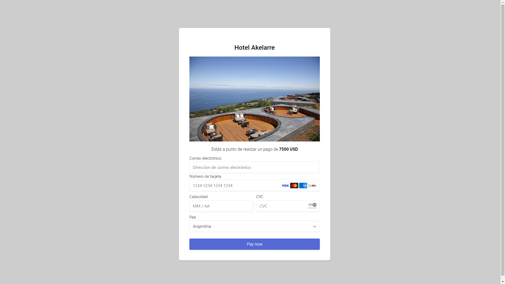

# Project: Society Management Application


I developed a society management application using Java and Spring Boot. The application provides a platform for managing various activities and booking hotel reservations. Users can create and participate in activities organized by the society, such as events, workshops, and meetings. Additionally, the system allows members to easily book hotels for these events directly through the platform, ensuring seamless coordination.

Key features of the project include:

Activity Management: Users can create, edit, and delete activities.
Hotel Booking: Members can reserve hotel rooms associated with activities.
User-friendly interface: Simple navigation and clear workflows for users to interact with.
This project aims to improve the efficiency of society management and enhance the user experience in organizing and attending events.

## Screenshots






## Tools Used

- Spring boot with maven
- Postgresql
- Stripe (payment)


## Environment Variables

To run this project, you will need to modify your application.properties file:

`spring.datasource.url`

`spring.datasource.username`

`spring.datasource.password`

`spring.mail.username`

`spring.mail.password`

`stripe.api.publicKey`

`stripe.api.secretKey`


## Run Application

```bash
  mvn spring-boot:run
```

## Authors

- [@Luis Francisco Martinez (Francisco9403)](https://github.com/Francisco9403)

